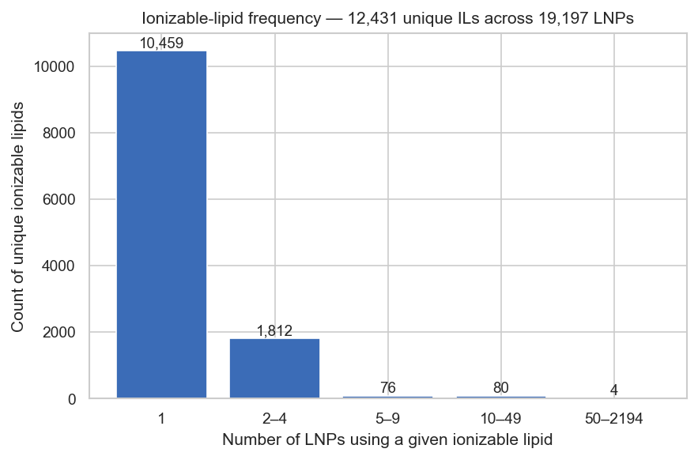
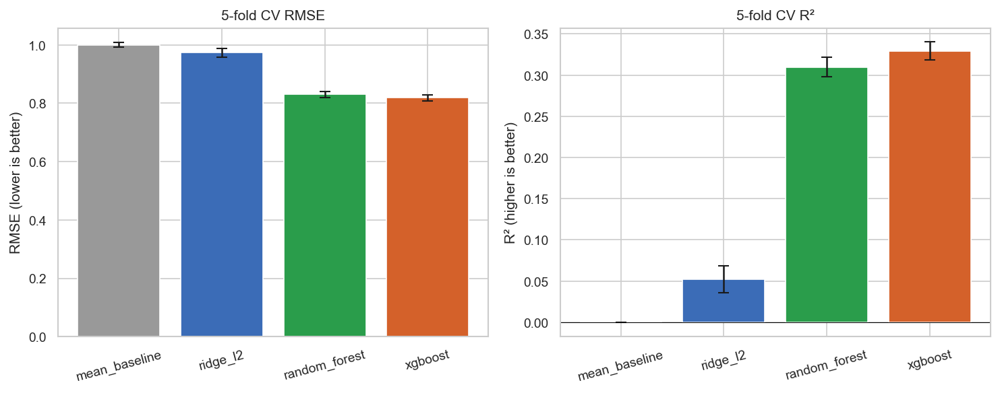
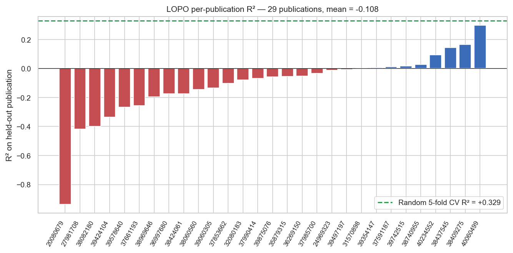
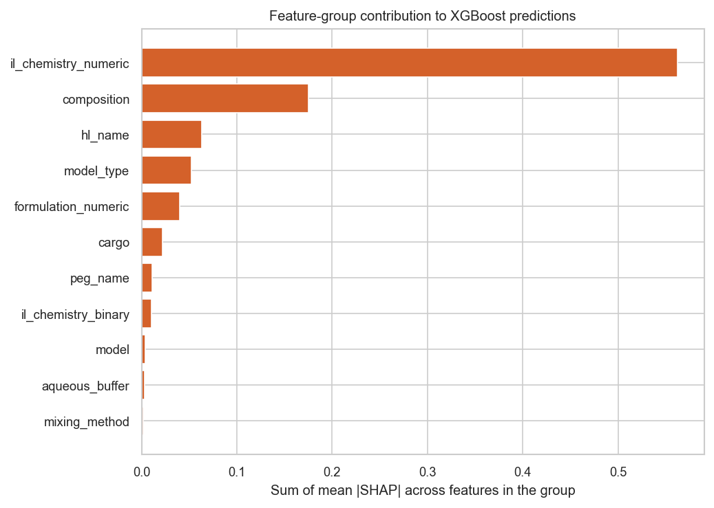
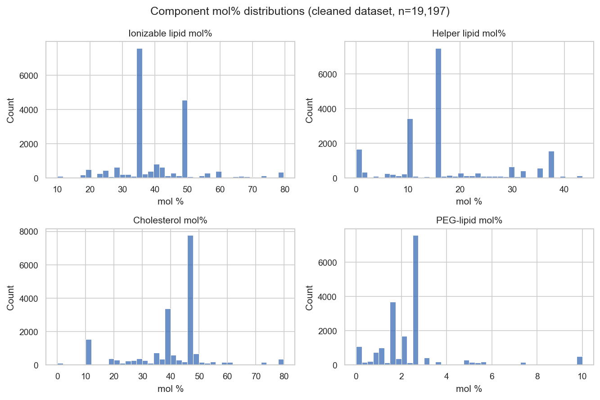
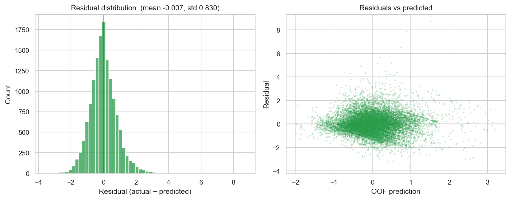
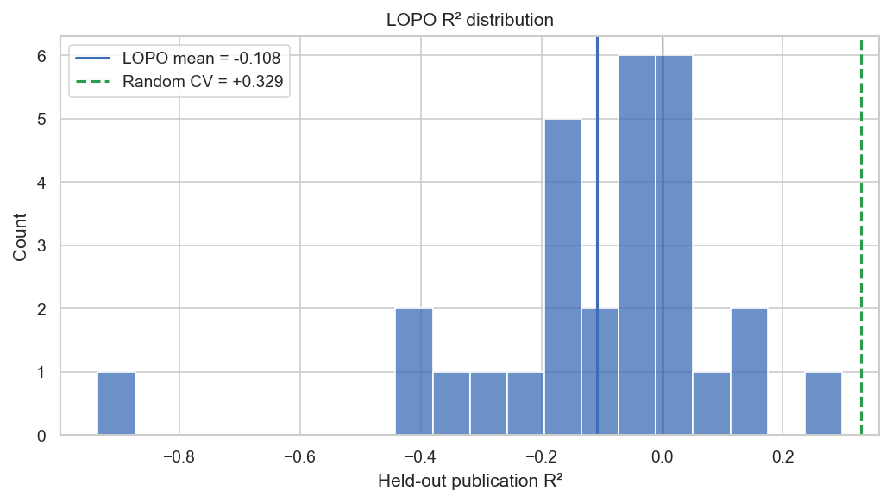

<!-- _class: lead -->
<!-- _paginate: false -->

# Predicting LNP delivery — and asking what it tells us about circRNA

**Rakesh Vayigandla** · Northeastern · 2026

A structure–function analysis of lipid nanoparticle composition for
nucleic-acid delivery, built on LNPDB (Collins et al., *Nat. Commun.* 2026).

---

## The question

Lipid nanoparticles (LNPs) deliver mRNA vaccines, siRNA therapies, and CRISPR
payloads — but every new cargo class still requires its own composition screen.

**Circular RNA (circRNA)** is a candidate next-generation cargo (more stable, can
encode arbitrary proteins). There is no public LNP–circRNA delivery dataset.

Two questions on the largest public LNP dataset (LNPDB, ~19,800 formulations):

1. **Which compositional features drive transfection efficiency**, and how does
   the answer shift in a sub-regime that approximates circRNA delivery?
2. **How well do those findings generalize across studies** — random CV vs LOPO?

---

## Data — LNPDB at a glance

- **19,797 LNPs × 66 columns**, freely downloadable, no auth required
- **42 source publications** + 1 commercial supplier
- **Cargo: mRNA 73.6%, siRNA 19.0%, pDNA 6.0%, no circRNA**
- Composition (mol% of each component), formulation parameters, biological
  context (cell line, route, cargo), assay readout — *and* pre-computed
  RDKit chemistry descriptors for each ionizable lipid
- Primary modeling subset: **n = 14,302** rows where the assay is
  `luminescence_normalized` (z-scored within method)

After cleaning: **19,197 LNPs** (drop NA-experiment rows, null targets, mol%-sum
outliers). Cleaned data → `data/processed/lnpdb_clean.parquet`.

---

## The single most important data fact

**12,431 unique ionizable lipids across 19,197 LNPs.**



- **10,459 (84%) appear exactly once**
- Only 4 lipids appear in 50+ formulations
- → categorical encoding of IL identity is hopeless
- → we represent ionizable lipids by their **17 chemistry descriptors** instead

---

## Methods

| Step | Tool |
|---|---|
| Cleaning | `src/data_loader.py::clean_lnpdb` with audit-trail |
| Features (57) | `src/features.py::build_features` — composition mol%, IL chemistry, lipid identities one-hot, cell line, cargo, mixing, buffer |
| Excluded as leakage | dose, publication PMID, cargo identity (FLuc/hEPO/etc.) |
| Models | Mean baseline → Ridge (L2) → Random Forest → tuned XGBoost |
| Tuning | RandomizedSearchCV, 30 candidates, 3-fold inner CV |
| Interpretation | TreeSHAP, group-aggregated |
| Honest CV | 5-fold random **plus** Leave-One-Publication-Out (LOPO) |

---

## Result 1 — random 5-fold CV: tree models win



|  | RMSE | R² |
|---|---:|---:|
| Mean baseline | 1.00 | 0.00 |
| Ridge | 0.97 | +0.05 |
| Random forest | 0.83 | +0.31 |
| **XGBoost (tuned)** | **0.82** | **+0.33** |

Linear effects are weak → signal is in interactions → tree models capture it.

---

## Result 2 — the LOPO gap (the headline)



- **Random 5-fold CV R² = +0.33**, **LOPO mean R² = −0.11**
- 8 / 29 publications have R² > 0; 3 / 29 have R² > 0.1
- ↳ the model is mostly memorizing **study-level** patterns, not portable signal

---

## Why LOPO matters

> *Random splits don't separate biological signal from study-level confounding.*

The 0.44-point gap means:

- The random-CV R² of 0.33 is **not** the right number to report
- "Holding out a row from study X" ≠ "predicting a new LNP from study X"
- The honest number is **LOPO mean R² = −0.11** — barely above mean baseline

**This is the project's most important methodological finding.** It is also a
known pathology of ML-on-biology that random-only-CV results across the field
likely suffer from.

---

## Result 3 — SHAP: ionizable-lipid chemistry dominates



```
il_chemistry  (0.55)  >>  composition (0.18)  >  hl_name ≈ cell_line (~0.05)
                                                 >  formulation > cargo
                                                 >  peg / il_chem_binary > everything else
```

- Top single features: `rotatable_bonds`, TPSA, `nitrogen_count`, `logp`
- Biophysics consistent: **more flexible, polar, aliphatic ILs deliver better**

---

## Result 4 — circRNA-like regime: levers shift

Subset: mRNA cargo + IL:NA mass ratio > 10 (n = 2,096 ≈ 18% of mRNAs).

| Feature group | All LNPs | circRNA-like | Δ |
|---|---:|---:|---|
| IL chemistry | 0.59 | 0.48 | ↓ |
| Composition mol% | 0.18 | 0.25 | ↑ |
| **Formulation (IL:NA ratio)** | 0.04 | **0.10** | **↑ 2.5×** |
| Helper lipid identity | 0.06 | 0.07 | slight ↑ |

**Top-5 shuffle:** in the demanding regime,
**`peg_molratio` becomes #1** (was #3) and **`IL:NA mass ratio` jumps from #8 to #2**.

**Hypothesis for circRNA:** tune PEG composition and IL loading first, chemistry second.

---

## What this work shows — and does not show

**Does show**
- Within-study, IL chemistry is the dominant lever; PEG/IL-loading lead in the
  demanding-delivery regime
- These shifts are biophysically plausible and direction-consistent

**Does not show**
- The model can predict efficiency for a study it has never seen → LOPO fails
- That the circRNA-like proxy regime is actually circRNA-like → no validation
- Generalization to novel chemistry or composition envelopes outside the two
  recipe families that dominate LNPDB

**Useful as:** a hypothesis-generation tool, not a black-box screening predictor.

---

## What would actually move this forward

In rough order of impact:

1. **LOPO-aware training** — group-aware boosting, domain-adversarial training,
   invariant risk minimization
2. **Within-recipe-family evaluation** — Onpattro vs Moderna/Pfizer separately
3. **Even ~100 LNPs of real circRNA-delivery data** would convert this from
   extrapolation to genuine fine-tuning
4. **Cargo sequence features** — length, GC content, secondary structure — once
   in the dataset

---

<!-- _class: lead -->

## One-sentence summary

> LNPDB is a useful dataset for generating composition hypotheses about LNP
> delivery; the model trained on it identifies ionizable-lipid chemistry as
> the dominant within-study lever and PEG / IL-loading as the top circRNA-regime
> levers; the cross-study generalization gap is wide enough that any of those
> hypotheses needs experimental validation before being trusted.

**Code + report:** github.com/rakeshvayigandla/circrna-lnp-prediction

---

<!-- _class: lead -->
<!-- _paginate: false -->

# Backup slides

Additional figures and detail follow.

---

## Mol% distributions — the dataset is recipe-clustered



Bimodal in every component: Onpattro-style (IL≈50%, CHL≈38%) vs
Moderna/Pfizer-style (IL≈35%, CHL≈46.5%). Limits extrapolation outside
these envelopes.

---

## Random-forest residuals — mean regression on the high tail



Predictions cap near +3 even when actuals reach +10. The rare high-performing
LNPs — exactly what we'd want to identify — are systematically under-predicted.

---

## LOPO R² distribution



Mean −0.108, median −0.056, max +0.30. Distribution is left-skewed: most
publications give worse-than-mean predictions.
